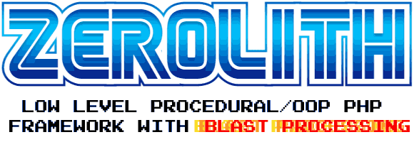

# Zerolith preview release R2 - for research/solo hacker/small scale purposes only

At this stage, the quality and user friendliness of this framework is a little more than halfway between a production ready release and some company's internal tool that is used in a specific environment.

We wouldn't call it a production ready system because:
- Documentation is ~70% complete
- The framework can't run anywhere other than the root of a domain ( example: https://yoursite.com/ ) due to hardcoded paths.
- Certain safety checks against drunk-coding are missing.
- UTF-8 support is not complete or toggleable yet.
- HTML sanitization has not been fully worked out yet. Blindly taking input from WYSIWYG editors is a bad idea unless you rig up your own sanitization routine.
- Input filtering exists but input validation doesn't yet.
- Various minor parts are incomplete.
- The unknown!

We would love you to file an issue if you encounter a bug, a function that is annoyingly inflexible, or some other gripe.

# What does the Zerolith framework offer?

Zerolith is currently a mostly complete substitute for mainstream PHP frameworks.

- Around 5x faster than most frameworks
- Short, consistent syntax with low cognitive overhead over vanilla PHP
- Can run standalone or be patched into existing frameworks and used for progressive enhancement
- First class integration with HTMX
- On-screen Debugger and mini profiler in developer mode
- Curl, MySQL, SQLite libraries
- Libraries for handling numbers, strings, arrays, filtering, time, system functions, validation, authentication, email, etc
- A bespoke unit + browser testing system designed for procedural code ( not included in preview )
- A frontend library for easy page/partial/UI element handling ( not mandatory to use )
- A CSS framework ( zl.css ) which is like Tailwind but shorter and written in Pure CSS
- ImageTender image recompressor daemon which uses advanced re-coding techniques to reduce images by ~50% without losing picture quality.
- More to come - we're just getting started!

# Why is it called Zerolith?

Two reasons:

#1: Popular frameworks like Symfony and Laravel have their ideological roots in the Spring framework for Java. The Spring framework is designed around a persistent execution model with monolithic structure.

Frameworks like Laravel and Symfony spend an inordinate amount of time creating a virtual monolith structure in order to provide a spring-like environment. In Java, you take the computational/mem overhead of building this large amount of structure one time, but in PHP you take this overhead on every request.

Zerolith is designed around PHP's original execution and thought model instead, which is neither 'microservices' or 'a monolith'. Our best term for PHP is that it's
 'polylithic'.

#2: Zerolith is designed from the start to have as close to zero as possible impact on performance. Early tests indicated it added 3% more computational load to a large vanilla PHP project, and it's been optimized since then. Spring-esque frameworks can add 500% overhead.

We call it Zerolith because it has virtually zero cpu/mem impact and imposed structure relative to it's competition.

# How the hell is it so fast?

- No monolith to build, no extra structure, the initialization routine takes about <1ms as a result.
- No OOP/MVC; the script using zerolith is in control of program flow.
- Instead of using an addon templating engine, we use PHP's inbuilt templating which is the fastest part of PHP and can actually outperform some higher level languages. The difference in cpu/mem vs using Twig, etc is enormous.
- We used John Carmack's programming advice, in particular using the smallest data structures possible for maximum performance and lowest memory usage. Because PHP is built on top of C, a lot of Carmack's low hanging fruit tricks actually worked.
- On top of this, the heavy parts of ZL have been optimized to the tilt with a profiler and the rest was written in a performance conscious way.

## Where is Zerolith headed?

This is an early version of a very ambitious work.
Zerolith has pretty small use right now. It currently powers 5 applications for a single software company and it's clients.
Zerolith wants to eventually provide a complete toolkit one day to help create applications as fast, if not faster, than existing state of the art, when it grows up.

## Outro

We hope you enjoy this early taste of Zerolith and look forward to your feedback.
Please see documents in [The docs folder](/zerolith/zpanel/docs) for further instruction!
